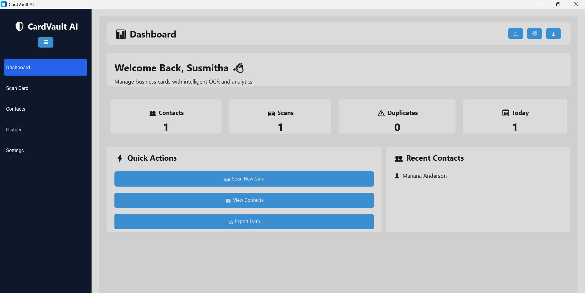
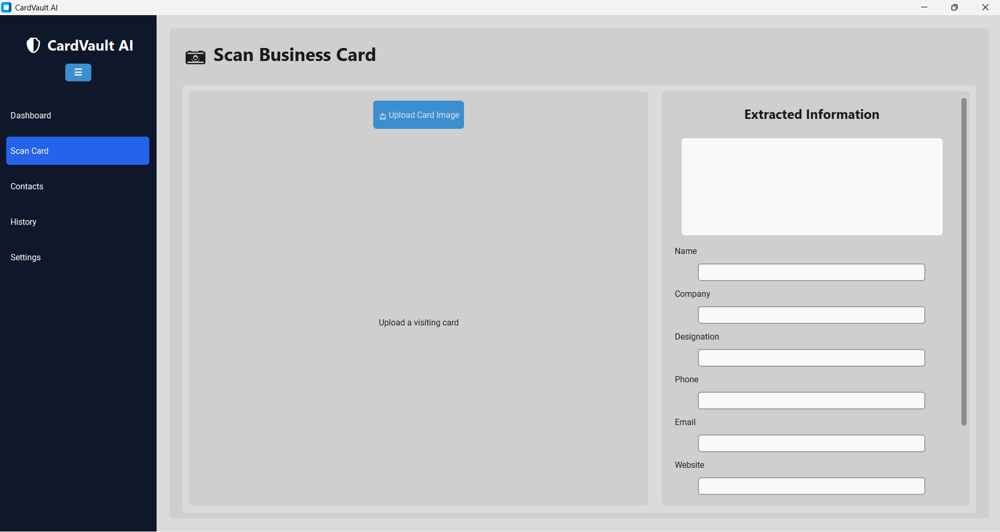
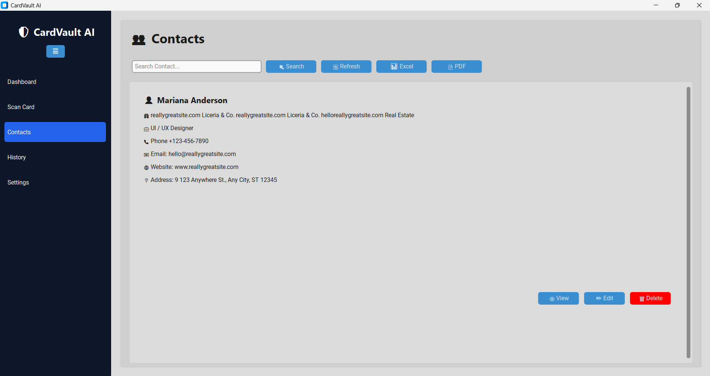
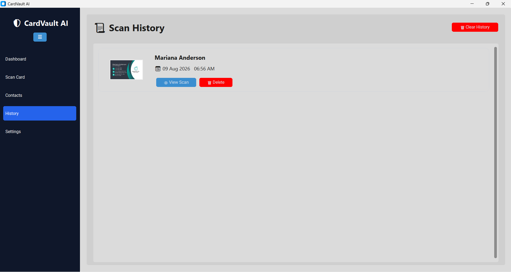
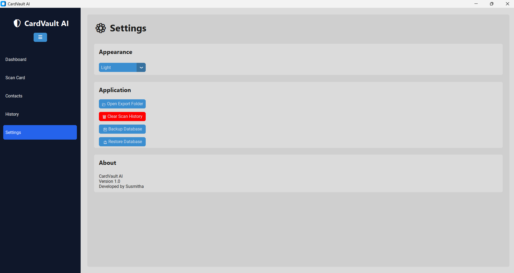

# CardVault AI

**Version:** 1.0  
**Developed by:** Susmitha  
**Project Type:** AI-Based Desktop Application for Business Card Management  
**Technology:** Python, OCR (Tesseract), CustomTkinter, SQLite  

---

# Project Overview

CardVault AI is an intelligent desktop application that scans business and visiting cards, extracts contact information using Optical Character Recognition (OCR), and stores the data in a searchable database. The application allows users to manage contacts efficiently by providing features such as viewing, editing, deleting, exporting, backup and restore, scan history, and duplicate detection.

The application is designed as a standalone Windows desktop application and can run without installing Python when packaged using PyInstaller.

---

# Problem Statement

Professionals and students often collect multiple business cards during meetings, seminars, conferences, and networking events. Managing these physical cards manually is difficult, time-consuming, and prone to loss or duplication.

CardVault AI solves this problem by digitizing business cards and storing them in an organized and searchable format.

---

# Objectives

- Scan business and visiting cards
- Extract text using OCR
- Automatically detect contact information
- Store contact details in a local SQLite database
- Maintain scan history
- Prevent duplicate contact entries
- Export contacts to Excel and PDF
- Provide backup and restore functionality
- Offer a simple and professional desktop user interface

---

# Features

## Dashboard
- Displays total contacts
- Displays total scans
- Displays duplicate count
- Displays today’s scans
- Shows recently added contacts
- Quick action buttons for common tasks

## Scan Business Card
- Upload image files
- Supports PNG, JPG, JPEG, BMP, and WEBP
- Image preview before scanning
- Automatic OCR text extraction
- Auto-fill contact fields
- Manual editing before saving

## Contact Management
- View contact details
- Edit contact information
- Delete contacts
- Search contacts by name, company, or phone number

## Scan History
- Displays all scanned cards
- Shows card preview image
- Shows scan date and time
- View scan details
- Delete individual history items
- Clear complete scan history

## Export
- Export contacts to Microsoft Excel (.xlsx)
- Export contacts to PDF format

## Settings
- Light/Dark appearance mode
- Open export folder
- Clear scan history
- Backup database
- Restore database
- Application information

## Duplicate Detection
Before saving a contact, the application checks whether the contact already exists (based on name or phone number) and prompts the user before creating a duplicate entry.

---

# Technology Stack

## Programming Language
- Python 3.13

## GUI
- CustomTkinter

## OCR Engine
- Tesseract OCR
- pytesseract

## Image Processing
- OpenCV
- Pillow (PIL)

## Database
- SQLite3

## Excel Export
- openpyxl

## PDF Export
- reportlab

## Packaging
- PyInstaller

---
# Application Screenshots

## Dashboard

## Scan Business Card

## Contacts Management

## Scan History

## Settings

# Project Structure

CardVaultAI/

├── assets/

├── database/

│   ├── database.py

│   └── cardvault.db

├── exports/

│   ├── excel/

│   └── pdf/

├── images/

├── modules/

│   ├── dashboard/

│   ├── scanner/

│   ├── contacts/

│   ├── history/

│   ├── settings/

│   └── parser/

├── main.py

└── README.md

---

# Installation (Development Mode)

1. Clone the repository

git clone https://github.com/susmitha2k0721/CardVaultAI.git

2. Open the project folder

cd CardVaultAI

3. Create virtual environment

python -m venv venv

4. Activate virtual environment

Windows PowerShell

.\venv\Scripts\Activate.ps1

5. Install dependencies

pip install customtkinter pillow pytesseract opencv-python openpyxl reportlab pyinstaller

6. Install Tesseract OCR

Download and install Tesseract OCR and ensure the executable path is correctly configured in the application.

7. Run the application

python main.py

---

# Executable Version

The project can also be distributed as a standalone Windows application.

To generate the executable:

pyinstaller --noconfirm --windowed --name CardVaultAI --add-data "database;database" --add-data "exports;exports" main.py

The executable will be available in:

dist/CardVaultAI/

---

# How to Use

1. Launch **CardVaultAI.exe**
2. Click **Upload Card Image**
3. Select a business card image
4. Wait for OCR extraction
5. Verify or edit the extracted details
6. Click **Save Contact**
7. View contacts in the **Contacts** section
8. Export data using **Excel** or **PDF**
9. Use **History** to review previous scans
10. Use **Settings** for backup, restore, and appearance options

---

# Database Schema

## Contacts Table

| Field | Type |
|------|------|
| id | INTEGER |
| name | TEXT |
| company | TEXT |
| designation | TEXT |
| phone | TEXT |
| email | TEXT |
| website | TEXT |
| address | TEXT |
| image_path | TEXT |
| created_at | TIMESTAMP |

## Scan History Table

| Field | Type |
|------|------|
| id | INTEGER |
| name | TEXT |
| image_path | TEXT |
| ocr_text | TEXT |
| scan_time | TIMESTAMP |

---

# OCR Workflow

Business Card Image

↓

OpenCV Preprocessing

↓

Grayscale Conversion

↓

Thresholding

↓

Tesseract OCR

↓

Text Extraction

↓

Field Parsing

↓

SQLite Database Storage

---

# Advantages

- Saves time
- Eliminates manual data entry
- Organizes contacts efficiently
- Reduces duplicate records
- Easy search and retrieval
- Portable database backup
- Offline desktop application
- User-friendly interface

---

# Limitations

- OCR accuracy depends on image quality
- Stylized fonts may reduce recognition accuracy
- Primarily optimized for English business cards
- Complex card layouts may require manual correction

---

# Future Enhancements

- Cloud synchronization
- Mobile application support
- QR code scanning
- Multi-language OCR
- Contact grouping and tagging
- Email integration
- Automatic duplicate merging
- AI-based business card classification

---

# Testing

The application has been tested for:

- OCR extraction
- Contact saving
- Duplicate detection
- Contact editing
- Contact deletion
- Search functionality
- History management
- Excel export
- PDF export
- Database backup and restore
- Theme switching
- Executable packaging

---

# Author

**Susmitha**  
B.Tech – Computer Science and Engineering (Artificial Intelligence)  
Annamacharya University, Rajampet  

---

# Acknowledgements

This project was developed as a final-year academic project using Python and open-source libraries including CustomTkinter, Tesseract OCR, OpenCV, Pillow, SQLite, OpenPyXL, ReportLab, and PyInstaller.

---

# License

This project is intended for educational and academic purposes.